# CHUYỂN ẢNH SANG SKETCH SỬ DỤNG CÁC THUẬT TOÁN XỬ LÝ ẢNH

# TỔNG QUAN DỰ ÁN

## Mục tiêu

- Xây dựng ứng dụng web chuyển đổi ảnh thành sketch (ảnh phác thảo bút chì)
- Áp dụng các thuật toán xử lý ảnh cơ bản
- Áp dụng kiến thức học phần **Xử lý ảnh (INT13146)**

## Tính năng chính

- 5 thuật toán xử lý ảnh: Convolution, Gaussian Blur, Sobel, Canny Edge, Morphology
- 2 phương pháp chuyển đổi: Dodge-Burn Sketch và Combined Sketch
- Giao diện web Flask thân thiện

---

# KIẾN TRÚC HỆ THỐNG

| Bước | Mô tả             | Thuật toán            |
| ---- | ----------------- | --------------------- |
| 1    | Upload Image      | -                     |
| 2    | Chuyển Grayscale  | cvtColor              |
| 3    | Sketch Conversion | Dodge-Burn / Combined |
| 4    | Enhancement       | Morphological Opening |
| 5    | Output Sketch     | -                     |

---

# THUẬT TOÁN 1: CONVOLUTION 2D

## Nền tảng của xử lý ảnh

Phép tích chập 2D - nền tảng cho mọi thuật toán xử lý ảnh

## Công thức toán học

$$G(x,y) = \sum_{i} \sum_{j} K(i,j) \times I(x+i, y+j)$$

Trong đó:

- **G**: Ảnh output
- **K**: Kernel (bộ lọc)
- **I**: Ảnh input

---

# CONVOLUTION 2D - CÁCH HOẠT ĐỘNG

## Bước 1: Duyệt qua từng vị trí có thể đặt kernel

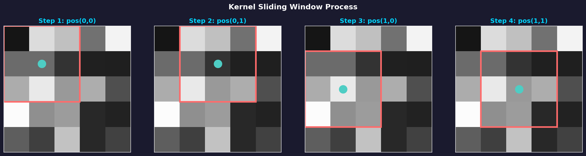

Kernel 3×3 trượt qua từng vị trí trên ảnh input, từ góc trên trái đến góc dưới phải.

---

# CONVOLUTION 2D - TÍNH TÍCH CHẬP

## Bước 2: Nhân từng phần tử với kernel và cộng lại

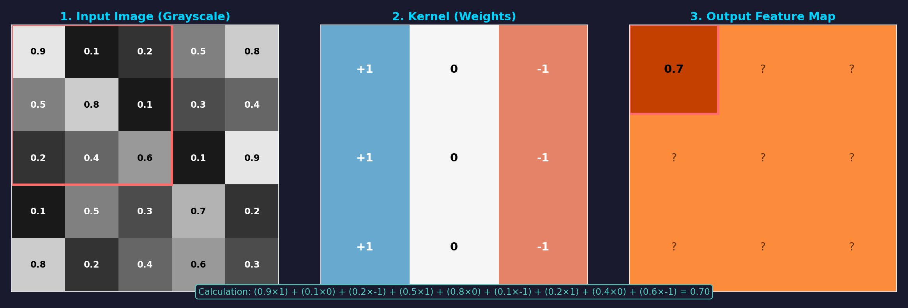

**Công thức tính:**

```
(0.9 × 1) + (0.1 × 0) + (0.2 × -1) +
(0.5 × 1) + (0.8 × 0) + (0.1 × -1) +
(0.2 × 1) + (0.4 × 0) + (0.6 × -1) = 0.70
```

---

# CONVOLUTION 2D - TỐI ƯU HÓA

## Separable Convolution

Nhiều kernel 2D có thể tách thành tích của 2 vector 1D:

$$K_{2D} = K_y \times K_x^T$$

**Ưu điểm về độ phức tạp:**

| Phương pháp        | Độ phức tạp |
| ------------------ | ----------- |
| Convolution thường | O(n × k²)   |
| Separable          | O(n × 2k)   |

**Ví dụ: Gaussian 5×5**

- Thay vì 25 phép nhân → chỉ cần 10 phép nhân
- Tăng tốc ~2.5 lần

---

# THUẬT TOÁN 2: GAUSSIAN BLUR

## Mục đích

Làm mờ ảnh dựa trên phân phối Gaussian (phân phối chuẩn)

## Công thức toán học

$$G(x,y) = \frac{1}{2\pi\sigma^2} \times e^{-\frac{x^2 + y^2}{2\sigma^2}}$$

## Đặc điểm

- Làm mờ đều theo mọi hướng (isotropic)
- Giảm nhiễu hiệu quả
- Bảo toàn cấu trúc tổng thể
- **Là bộ lọc tách được** → tối ưu tính toán

---

# GAUSSIAN BLUR - TẠO KERNEL

## Kernel Gaussian 1D và 2D

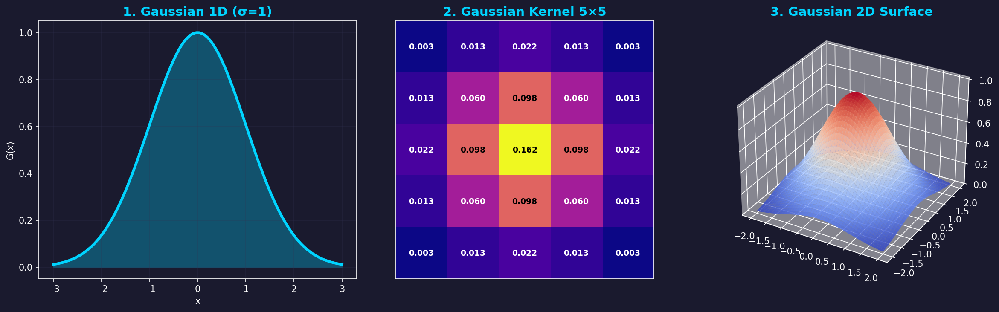

**Đặc điểm kernel:**

- Giá trị cao ở trung tâm → pixel gần trọng số lớn
- Giá trị thấp ở biên → pixel xa trọng số nhỏ
- Tổng tất cả giá trị = 1 (bảo toàn độ sáng)

---

# GAUSSIAN BLUR - ẢNH HƯỞNG CỦA SIGMA

## So sánh các giá trị sigma khác nhau

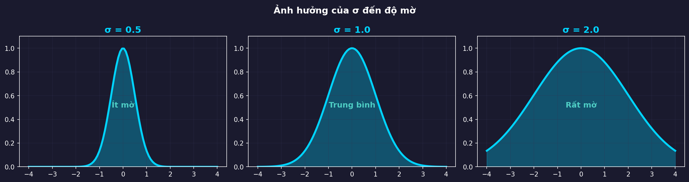

| Sigma | Hiệu ứng              |
| ----- | --------------------- |
| σ = 1 | Mờ nhẹ, giữ chi tiết  |
| σ = 3 | Mờ trung bình         |
| σ = 5 | Mờ mạnh, mất chi tiết |

---

# THUẬT TOÁN 3: SOBEL OPERATOR

## Mục đích

Tính gradient (đạo hàm) của ảnh - phát hiện biên

## Kernel Sobel 3×3

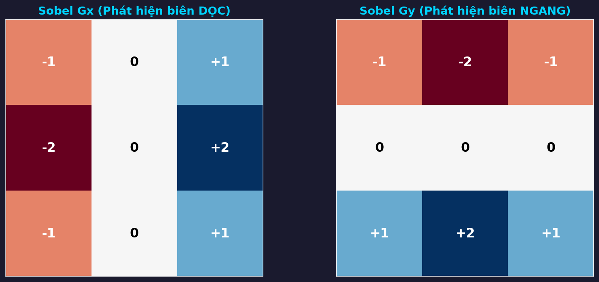

- **Gx**: Phát hiện biên DỌC (thay đổi theo chiều ngang)
- **Gy**: Phát hiện biên NGANG (thay đổi theo chiều dọc)

---

# SOBEL - TÍNH TOÁN OUTPUT

## Các đại lượng được tính

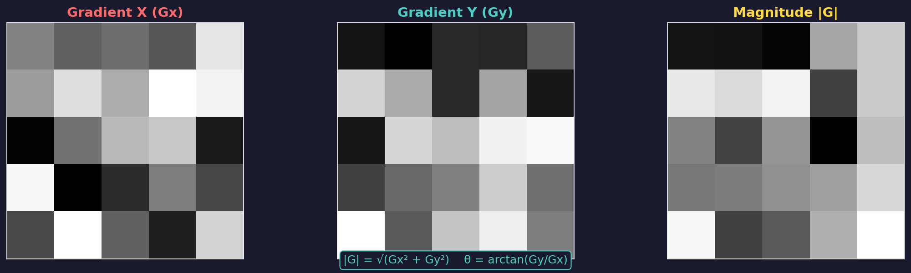

| Đại lượng  | Công thức             | Ý nghĩa          |
| ---------- | --------------------- | ---------------- |
| Gradient X | Gx = Image ⊗ Kernel_x | Biến thiên ngang |
| Gradient Y | Gy = Image ⊗ Kernel_y | Biến thiên dọc   |
| Magnitude  | M = √(Gx² + Gy²)      | Cường độ biên    |
| Direction  | θ = arctan2(Gy, Gx)   | Hướng biên       |

---

# THUẬT TOÁN 4: CANNY EDGE DETECTION

## Thuật toán phát hiện biên tối ưu

Canny được coi là "gold standard" vì:

- **Good detection**: Phát hiện đúng biên thật
- **Good localization**: Vị trí biên chính xác
- **Minimal response**: Mỗi biên chỉ đánh dấu 1 lần

## 5 Bước của Canny

| Bước | Tên                 | Mục đích       |
| ---- | ------------------- | -------------- |
| 1    | Gaussian Blur       | Giảm nhiễu     |
| 2    | Sobel Gradient      | Tính đạo hàm   |
| 3    | Non-max Suppression | Làm mỏng biên  |
| 4    | Double Threshold    | Phân loại biên |
| 5    | Hysteresis          | Nối biên       |

---

# CANNY - PIPELINE TỔNG QUAN

## Các bước xử lý từ input đến output

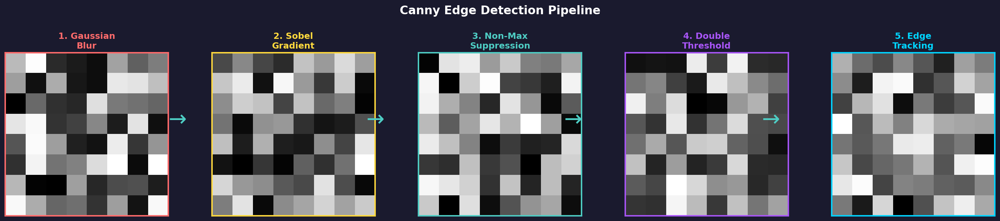

Qua 5 bước xử lý, ảnh có nhiễu được chuyển thành biên sắc nét, chính xác.

---

# CANNY - BƯỚC 3: NON-MAXIMUM SUPPRESSION

## Làm mỏng biên - chỉ giữ pixel maximum

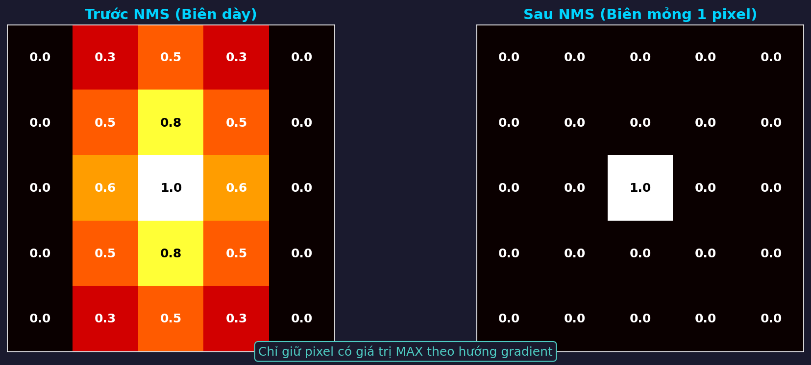

**Nguyên lý:**

- Với mỗi pixel, so sánh với 2 pixel láng giềng **theo hướng gradient**
- Chỉ giữ nếu pixel đó là **maximum cục bộ**
- Kết quả: Biên dày → Biên mỏng 1 pixel

---

# CANNY - BƯỚC 4: DOUBLE THRESHOLDING

## Phân loại pixel thành 3 loại

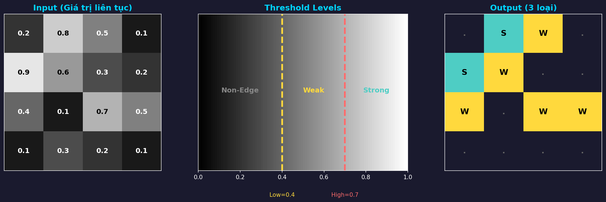

| Loại            | Điều kiện          | Xử lý             |
| --------------- | ------------------ | ----------------- |
| **Strong Edge** | pixel > High       | Chắc chắn là biên |
| **Weak Edge**   | Low < pixel < High | Cần xác nhận      |
| **Non-Edge**    | pixel < Low        | Loại bỏ           |

---

# CANNY - BƯỚC 5: HYSTERESIS

## Kết nối biên yếu với biên mạnh

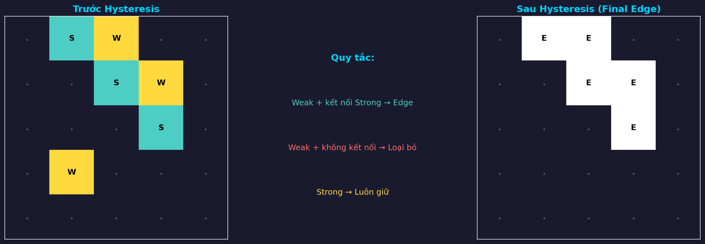

**Nguyên lý:**

- Weak edge kết nối với Strong → **Giữ** (chuyển thành Strong)
- Weak edge đứng riêng lẻ → **Loại bỏ**

---

# THUẬT TOÁN 5: MORPHOLOGICAL OPERATIONS

## Phép toán hình thái học

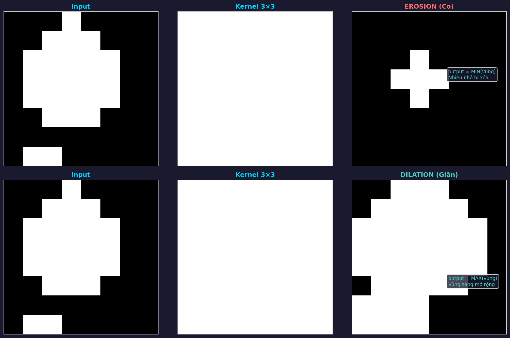

| Phép toán    | Công thức          | Tác dụng                 |
| ------------ | ------------------ | ------------------------ |
| **Erosion**  | output = MIN(vùng) | Co vùng sáng, loại nhiễu |
| **Dilation** | output = MAX(vùng) | Giãn vùng sáng           |

---

# MORPHOLOGY - OPENING

## Opening = Erosion → Dilation

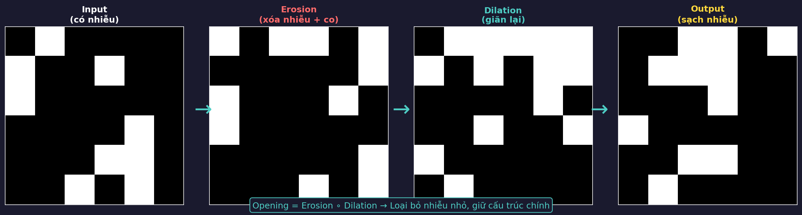

**Tác dụng của Opening:**

- Loại bỏ nhiễu nhỏ (điểm sáng nhỏ hơn kernel)
- Giữ nguyên cấu trúc lớn
- Sử dụng để denoise trong sketch

---

# PHƯƠNG PHÁP 1: DODGE-BURN SKETCH

## Kỹ thuật truyền thống tạo hiệu ứng bút chì

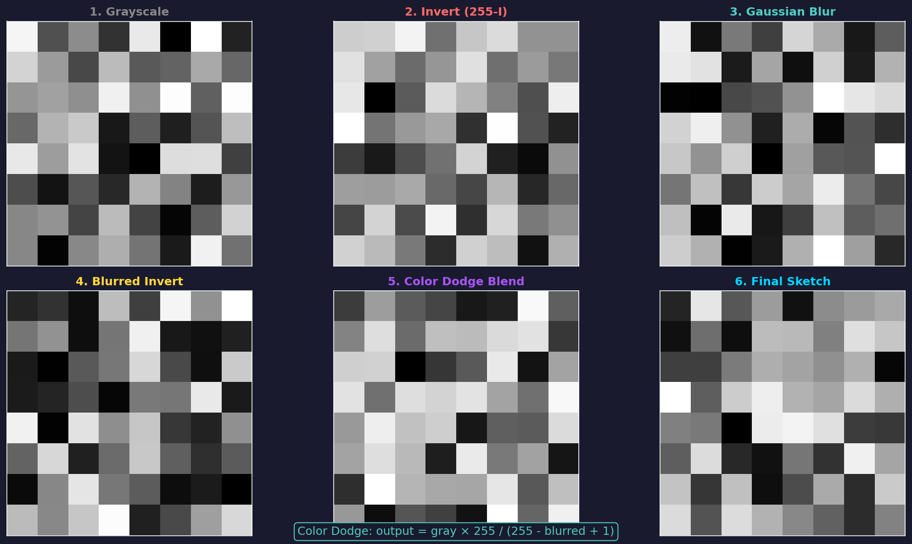

## Các bước xử lý

| Bước | Công thức                        | Mô tả          |
| ---- | -------------------------------- | -------------- |
| 1    | inverted = 255 - gray            | Đảo ngược ảnh  |
| 2    | blurred = GaussianBlur(inverted) | Làm mờ         |
| 3    | inv_blur = 255 - blurred         | Đảo ngược blur |
| 4    | sketch = (gray × 256) / inv_blur | Divide blend   |

---

# DODGE-BURN - TẠI SAO HIỆU QUẢ?

## Công thức tạo hiệu ứng sketch

$$sketch = \frac{gray \times 256}{255 - blurred}$$

**Phân tích:**

| Vùng      | Đặc điểm           | Kết quả                     |
| --------- | ------------------ | --------------------------- |
| Vùng tối  | gray thấp          | sketch tối (nét bút chì)    |
| Vùng sáng | gray cao, blur cao | sketch sáng (nền trắng)     |
| Vùng biên | gray ≠ blur nhiều  | contrast cao (đường nét rõ) |

---

# PHƯƠNG PHÁP 2: COMBINED SKETCH

## Kết hợp Dodge-Burn + Canny Edge

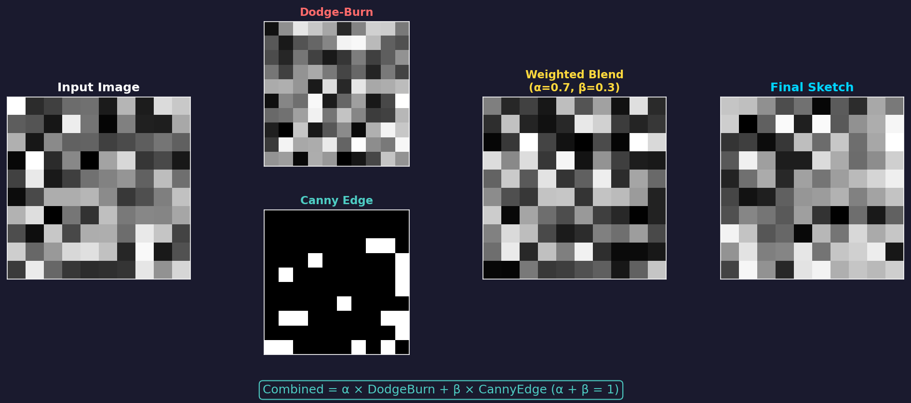

## Công thức kết hợp

$$Combined = \alpha \times DodgeBurn + \beta \times CannyEdge$$

Với: α = 0.9 (90%), β = 0.1 (10%)

---

# COMBINED - TẠI SAO KẾT HỢP?

## So sánh ưu nhược điểm

| Thành phần   | Ưu điểm               | Nhược điểm       |
| ------------ | --------------------- | ---------------- |
| Dodge-Burn   | Shading mềm, tự nhiên | Biên không rõ    |
| Canny Edge   | Biên sắc nét          | Không có shading |
| **Combined** | **Cả hai ưu điểm**    | -                |

**Kết quả:** Sketch có shading mềm mại VÀ biên sắc nét.

---

# POST-PROCESSING

## Các bước nâng cao chất lượng

### 1. Bilateral Filter

- Làm mịn vùng phẳng
- Giữ nguyên biên (edge-preserving)

### 2. Unsharp Masking

$$sharp = 1.3 \times sketch - 0.3 \times GaussianBlur(sketch)$$

Tăng độ sắc nét bằng cách trừ đi ảnh mờ.

### 3. Gamma Correction

$$output = \left(\frac{input}{255}\right)^{1/\gamma} \times 255$$

Với γ = 1.15 → làm sáng nhẹ nền.

---

# ENHANCEMENT: MORPHOLOGICAL DENOISE

## Loại bỏ nhiễu bằng Opening

**Sử dụng thuật toán Morphological Opening:**

```python
kernel = create_kernel('ellipse', 3)  # Kernel ellipse 3x3
cleaned = opening(sketch, kernel)     # Erosion + Dilation
```

**Kết quả:**

- Điểm nhiễu nhỏ bị loại bỏ
- Nét vẽ chính được giữ nguyên

---

# TỔNG KẾT THUẬT TOÁN

| #   | Thuật toán            | Chức năng                     |
| --- | --------------------- | ----------------------------- |
| 1   | **Convolution2D**     | Nền tảng xử lý ảnh            |
| 2   | **GaussianBlur**      | Làm mờ, giảm nhiễu            |
| 3   | **SobelOperator**     | Tính gradient, phát hiện biên |
| 4   | **CannyEdgeDetector** | Phát hiện biên chính xác      |
| 5   | **MorphologicalOps**  | Xử lý hình thái học           |

---

# CẤU TRÚC DỰ ÁN

```
SketchLab/
├── app.py                          # Flask application
├── config.py                       # Cấu hình
├── requirements.txt
│
├── core/                           # Image processing modules
│   ├── sketch_converter.py         # SketchConverter class
│   ├── sketch_enhancer.py          # SketchEnhancer class
│   │
│   └── algorithms/                 # Các thuật toán xử lý ảnh
│       ├── convolution.py          # Convolution2D
│       ├── gaussian_blur.py        # GaussianBlur
│       ├── sobel.py                # SobelOperator
│       ├── canny.py                # CannyEdgeDetector
│       └── morphology.py           # MorphologicalOperations
│
├── templates/                      # HTML templates
└── static/                         # CSS, JS, uploads
```

---

# DEMO ỨNG DỤNG

## Giao diện Web Flask

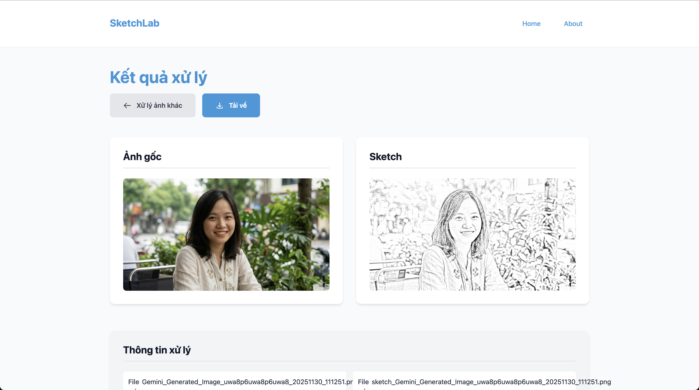
**Tính năng:**

- Upload ảnh: Drag & drop hoặc click chọn file
- Chọn thuật toán: Combined Sketch hoặc Dodge-Burn
- Tự động denoise
- Preview so sánh side-by-side
- Download kết quả

**Thông số:**

- Thời gian xử lý: ~1-3 giây
- Kích thước tối đa: 1024×1024 pixel
- Định dạng: PNG, JPG, JPEG

---

# KẾT QUẢ DEMO

## So sánh Input vs Output


Original Image

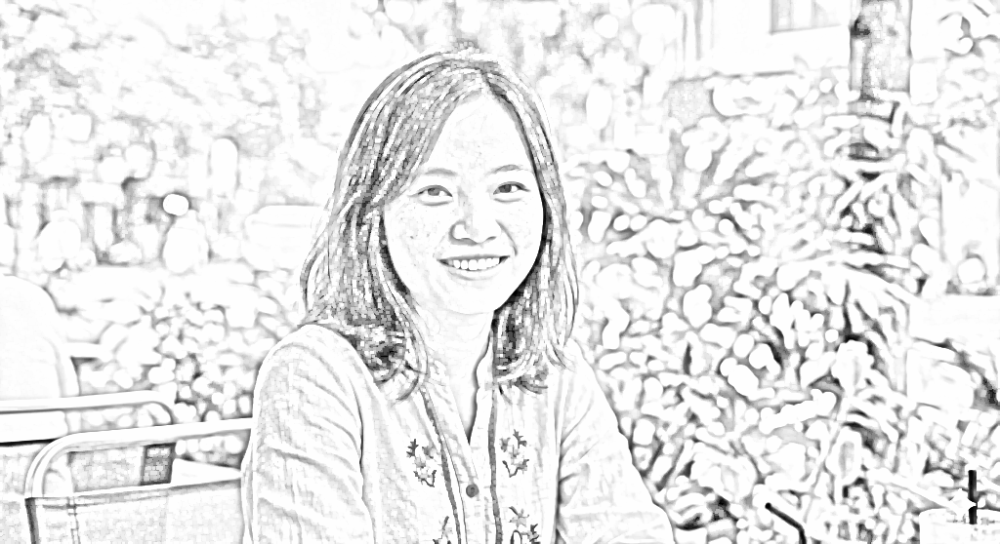
Sketch Output

**Đặc điểm output:**

- Nền trắng sáng
- Đường nét rõ ràng như bút chì
- Shading mềm mại tự nhiên
- Không có nhiễu

---

# KẾT LUẬN

## Đã hoàn thành

- Xây dựng ứng dụng web chuyển ảnh sang sketch
- Áp dụng 5 thuật toán xử lý ảnh
- Áp dụng kiến thức học phần Xử lý ảnh

## Kiến thức áp dụng

- Phép tích chập 2D và tối ưu separable
- Bộ lọc Gaussian và ứng dụng làm mờ
- Toán tử Sobel tính gradient
- Thuật toán Canny phát hiện biên (5 bước)
- Phép toán hình thái học (Erosion, Dilation, Opening)

## Hướng phát triển

- Thêm nhiều style sketch khác
- Tối ưu hiệu năng với GPU
- Hỗ trợ xử lý video

---

# TÀI LIỆU THAM KHẢO

1. **Gonzalez & Woods** - Digital Image Processing (4th Edition)
2. **Canny, J.** - A Computational Approach to Edge Detection (1986)
3. **OpenCV Documentation** - https://docs.opencv.org/
4. **Đề cương học phần** - Xử lý ảnh (INT13146) - PTIT

---

# CẢM ƠN ĐÃ LẮNG NGHE!

## Q&A

**Repository**: [Link GitHub]

**Demo**: http://127.0.0.1:5000

---

# PHỤ LỤC: HÌNH ẢNH MINH HỌA

Tất cả hình ảnh minh họa lưu tại thư mục `images/`:

| File                         | Mô tả                      |
| ---------------------------- | -------------------------- |
| `01_convolution.png`         | Minh họa phép tích chập    |
| `02_convolution_sliding.png` | Kernel trượt qua ảnh       |
| `03_gaussian_kernel.png`     | Gaussian kernel 1D, 2D, 3D |
| `04_gaussian_sigma.png`      | So sánh các giá trị sigma  |
| `05_sobel_kernels.png`       | Sobel kernels Gx, Gy       |
| `06_sobel_output.png`        | Output của Sobel           |
| `07_canny_pipeline.png`      | Pipeline 5 bước Canny      |
| `08_nms.png`                 | Non-Maximum Suppression    |
| `09_double_threshold.png`    | Double Thresholding        |
| `10_hysteresis.png`          | Hysteresis                 |
| `11_morphology_basic.png`    | Erosion và Dilation        |
| `12_opening.png`             | Opening operation          |
| `13_dodge_burn.png`          | Dodge-Burn pipeline        |
| `14_combined_sketch.png`     | Combined Sketch            |

---
